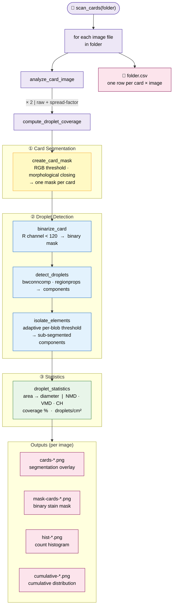

# WSP Scan — MATLAB Pipeline

Analysis of spray coverage on Water Sensitive Paper (WSP) from flatbed scanner images.
The pipeline detects WSP cards, counts droplet stains, and computes standard spray
characterisation metrics: NMD, VMD, Coefficient of Homogeneity, and coverage percentage.

---

## Requirements

| Toolbox | Required for |
|---|---|
| Image Processing Toolbox | all functions |
| Curve Fitting Toolbox | `spread_factor_equation.m` only |

Tested on MATLAB R2021a and later.

---

## Quick Start

```matlab
% Process all scan images in a folder (output written to '<folder>/results/')
scan_cards('C:\scans\trial_01')

% Specify a custom output directory
scan_cards('C:\scans\trial_01', 'C:\output\trial_01')

% Use custom card labels
scan_cards('C:\scans\trial_01', '', {'A-H','B-H','C-H','A-L','B-L','C-L'})
```

Supported image formats: `.tif`, `.tiff`, `.png`, `.jpg`, `.jpeg`, `.bmp`.

---

## Pipeline Overview

```
scan_cards
  └─ analyze_card_image          (one call per image file)
       └─ compute_droplet_coverage  (called twice: raw + spread-factor)
            ├─ create_card_mask      Stage 1 — card segmentation
            ├─ binarize_card         Stage 2a — stain binarisation
            ├─ detect_droplets       Stage 2b — connected-component labelling
            ├─ isolate_elements      Stage 2c — adaptive sub-segmentation
            └─ droplet_statistics    Stage 3 — diameter statistics
```



### Stage 1 — Card Segmentation (`create_card_mask`)

Cards are detected by RGB colour thresholding:

| Condition | Detected region |
|---|---|
| `R > B+50` AND `G > B+50` | Yellow unsprayed card background |
| `B > R+15` AND `B > G+15` | Blue/purple water-stained card regions |

After thresholding, small noise regions are removed (`bwareaopen`, min 1000 px),
holes are filled (`imfill`), and the mask is smoothed with morphological closing
(`imclose`, disk SE radius 50 px).

Cards are then split into a left column and a right column based on horizontal
position (threshold: leftmost third of the image width), and sorted top-to-bottom
within each column.  Default labels are `WSP-1` … `WSP-n`.

### Stage 2 — Droplet Detection

1. **Binarisation** (`binarize_card`) — pixels with red channel < 120 inside the
   card mask are classified as stain.
2. **Component labelling** (`detect_droplets`) — 8-connected components are extracted
   with `bwconncomp`/`regionprops`.  No minimum size filter is applied at this stage.
3. **Sub-segmentation** (`isolate_elements`) — for each component an adaptive threshold
   is computed:
   ```
   threshold = 190 - (190 - min(R_in_blob)) / 2
   ```
   The blob is re-binarised with this tighter threshold.  Because `R` is `uint8`,
   the division uses MATLAB integer arithmetic (round-half-to-even), so the threshold
   is always an integer.  If sub-regions are found they replace the original component;
   otherwise the original is kept.

### Stage 3 — Statistics (`droplet_statistics`)

The area of each connected component (in pixels) is converted to an equivalent
circular diameter:

```
stain_diameter (µm) = pixel_size × sqrt(4 × area / π)
pixel_size (µm/px)  = 25 400 / DPI
```

Default scanner DPI is **600** (hardcoded in the `droplet_statistics` call inside
`compute_droplet_coverage.m`; edit that line if you use a different scanner).

**Spread-factor correction** (optional): stain diameter is converted to real droplet
diameter using the polynomial fitted in `spread_factor_equation.m`:

```
droplet_diameter = 0.53549306 × stain_diameter − 0.000084839 × stain_diameter²
```

`compute_droplet_coverage` is called twice per image — once without and once with
this correction — and both result sets are written to the output CSV.

**Size metrics computed:**

| Metric | Description |
|---|---|
| NMD / NMD10 / NMD90 | Numeric Median Diameter and percentiles |
| VMD / VMD10 / VMD90 | Volume Median Diameter and percentiles |
| CH | Coefficient of Homogeneity (VMD / NMD) |
| covered_area_pct | Stain area as percentage of card area |
| droplet_count | Total number of detected droplets |
| droplets_per_cm² | Droplet density (card area = 2.6 × 7.6 cm) |

---

## Output

`scan_cards` writes two types of output to `results_dir`:

### CSV file — `<folder_name>.csv`

One row per card per image.  Columns:

```
filename, card,
NMD, NMD10, NMD90, VMD, VMD10, VMD90, CH, mean_diameter, std_diameter,
covered_area_pct, droplet_count, droplets_per_cm2,
NMD_SF, NMD10_SF, NMD90_SF, VMD_SF, VMD10_SF, VMD90_SF,
CH_SF, mean_diameter_SF, std_diameter_SF
```

Columns without `_SF` use raw stain diameters; columns with `_SF` use
spread-factor corrected diameters.

### PNG plots — per image

| File | Contents |
|---|---|
| `cards-<name>.png` | Card segmentation mask with labels |
| `mask-cards-<name>.png` | Binary stain mask (union of all cards) |
| `hist-<name>.png` | Droplet count histogram by diameter bin |
| `cumulative-<name>.png` | Cumulative diameter distribution (%) |

---

## Function Reference

| Function | Description |
|---|---|
| `scan_cards.m` | Top-level entry point.  Iterates over images in a directory and writes a summary CSV. |
| `analyze_card_image.m` | Processes a single scan image: runs the pipeline for both raw and SF-corrected diameters and saves plots. |
| `compute_droplet_coverage.m` | Core analysis loop: loads the image, segments cards, detects droplets, computes statistics. |
| `create_card_mask.m` | Segments WSP cards from the scanner background using RGB thresholding and morphological closing. |
| `binarize_card.m` | Binarises a single card by thresholding the red channel. |
| `detect_droplets.m` | Labels connected components in a binary image (8-connectivity, no area filter). |
| `isolate_elements.m` | Adaptive sub-segmentation: tries to split merged droplet blobs using a tighter per-blob threshold. |
| `droplet_statistics.m` | Computes NMD, VMD, CH, coverage, and diameter histogram for a set of detected components. |
| `spread_factor_equation.m` | Utility: fits and plots the spread-factor calibration curve (requires Curve Fitting Toolbox). |

### `testing_functionalities/`

Scripts used during development to verify Python parity — not part of the
production pipeline:

| Script | Purpose |
|---|---|
| `export_masks.m` | Saves per-card binary masks (cardmask, stainmask, step1mask, step2mask) for pixel-level comparison with Python output. |
| `export_subcomps_matlab.m` | Dumps per-blob sub-component count and area list for every card, used to diagnose isolate_elements differences. |
| `dump_blob_matlab.m` | Dumps the exact `imcrop` and direct-index crops for a single discrepant blob; used to confirm the +1 row/col imcrop behaviour. |

---

## WSP Card Layout

The pipeline expects a flatbed scan containing **6 WSP cards** arranged in two
columns of three:

```
[ WSP-1 ]  [ WSP-4 ]
[ WSP-2 ]  [ WSP-5 ]
[ WSP-3 ]  [ WSP-6 ]
```

A different number of cards is supported as long as the left / right column
split (leftmost third of image width) correctly separates the columns.
Custom labels can be passed via the `card_names` argument.
