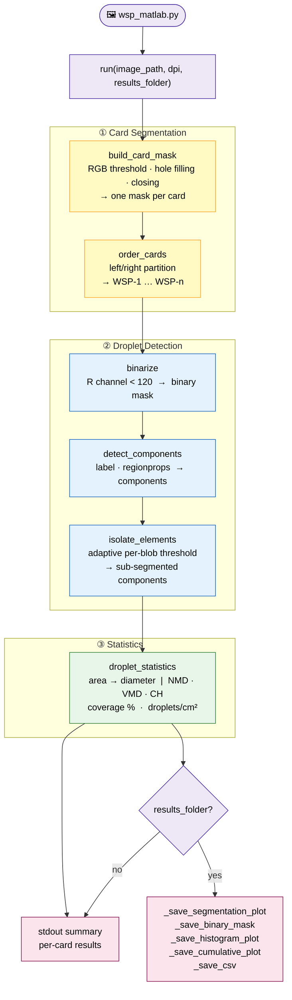

# WSP Scan — Python Line-by-Line Translation

Direct Python translation of the MATLAB WSP pipeline in `matlab/`.
This version preserves the MATLAB algorithm exactly: the same stages, thresholds,
constants, and ordering rules are used, with **DPI** as the only external parameter
(default: **600**). No config file is used.

---

## Requirements

| Dependency | Required for |
|---|---|
| `numpy` | array operations and MATLAB-equivalent numeric processing |
| `scipy` | `binary_fill_holes` |
| `scikit-image` | connected components and morphology |
| `tifffile` | reading TIFF scan images |
| `matplotlib` | PNG plot output (optional) |

All dependencies are listed in `requirements.txt` with minimum version constraints.
Python **3.7 or later** is required.

---

## Environment Setup

### Windows

```bat
:: Create and activate a virtual environment
python -m venv wsp-env
wsp-env\Scripts\activate

:: Install dependencies
pip install -r requirements.txt

:: Run
python wsp_matlab.py C:\scans\trial_01.tif
```

### macOS / Linux

```bash
# Create and activate a virtual environment
python3 -m venv wsp-env
source wsp-env/bin/activate

# Install dependencies
pip install -r requirements.txt

# Run
python wsp_matlab.py /path/to/trial_01.tif
```

### Using conda (Windows / macOS / Linux)

```bash
conda create -n wsp-env python=3.11
conda activate wsp-env
pip install -r requirements.txt

python wsp_matlab.py /path/to/trial_01.tif
```

> **Tip:** deactivate the environment when done with `deactivate` (venv) or
> `conda deactivate` (conda).

---

## Quick Start

```bash
# stdout only
python wsp_matlab.py /path/to/trial_01.tif

# save CSV + 4 PNG plots to a folder
python wsp_matlab.py /path/to/trial_01.tif --results-folder /path/to/results

# custom DPI
python wsp_matlab.py /path/to/trial_01.tif --dpi 1200 --results-folder /path/to/results
```

Supported input is whatever `tifffile.imread()` can read directly; grayscale images
are promoted to RGB internally, and extra channels are ignored after the first three.

---

## Pipeline Overview

```
wsp_matlab.py
  └─ run                          (one call per image file)
       ├─ build_card_mask         Stage 1 — card segmentation
       ├─ order_cards             card ordering
       ├─ binarize                Stage 2a — stain binarisation
       ├─ detect_components       Stage 2b — connected-component labelling
       ├─ isolate_elements        Stage 2c — adaptive sub-segmentation
       └─ droplet_statistics      Stage 3 — diameter statistics
```



### Stage 1 — Card Segmentation (`build_card_mask`)

`build_card_mask` is the Python translation of `create_card_mask.m`. It applies the
same RGB thresholds, fills holes, removes regions smaller than 1000 pixels, and
performs morphological closing with the MATLAB-equivalent disk structuring element.

`order_cards` reproduces the card ordering logic from `create_card_mask.m`: cards are
split into left and right columns using the leftmost third of the image width, then
sorted top-to-bottom within each column.

### Stage 2 — Droplet Detection

1. **Binarisation** (`binarize`) — translation of `binarize_card.m`; pixels with red
   channel `< 120` inside the card mask are classified as stain.
2. **Component labelling** (`detect_components`) — translation of `detect_droplets.m`;
   8-connected components are extracted with `label`/`regionprops`. No minimum area
   filter is applied.
3. **Sub-segmentation** (`isolate_elements`) — translation of `isolate_elements.m`;
   each blob is re-thresholded with:
   ```
   threshold = 190 - (190 - min(R_in_blob)) / 2
   ```
   where the division uses **integer rounding** (Python `round()`, matching MATLAB's
   uint8 arithmetic with round-half-to-even) so the threshold is always an integer.
   If sub-components are found, they replace the original component; otherwise the
   original component is kept.

### Stage 3 — Statistics (`droplet_statistics`)

`droplet_statistics` is the Python translation of `droplet_statistics.m`. Component
area is converted to equivalent circular diameter using the same DPI-dependent formula:

```
stain_diameter (µm) = pixel_size × sqrt(4 × area / π)
pixel_size (µm/px)  = 25 400 / DPI
```

The function computes NMD, VMD, percentile variants, CH, mean diameter, and standard
deviation. The script prints raw and spread-factor corrected results for each card.

---

## Output

Results are always printed to stdout. When `--results-folder` is given, four PNG plots
and a CSV file are also saved there:

| File | Contents |
|---|---|
| `cards-<name>.png` | Card segmentation overlay — one label per detected card |
| `mask-cards-<name>.png` | Full binary stain mask across all cards |
| `hist-<name>.png` | Grouped bar histogram of droplet sizes (spread-factor corrected) |
| `cumulative-<name>.png` | Cumulative diameter distribution (%) per card (raw, no SF) |
| `<name>.csv` | Per-card statistics (same columns as `scan_cards.m` output) |

The CSV columns match the MATLAB output exactly:
`filename, card, NMD, NMD10, NMD90, VMD, VMD10, VMD90, CH, mean_diameter, std_diameter,`
`covered_area_pct, droplet_count, droplets_per_cm2, NMD_SF, …_SF`

---

## Function Reference

| Python function | MATLAB counterpart | Description |
|---|---|---|
| `run` | `compute_droplet_coverage.m` | Top-level per-image pipeline: reads the image, detects cards, detects droplets, prints per-card statistics, and optionally saves CSV + PNG plots. |
| `build_card_mask` | `create_card_mask.m` | Segments WSP cards from the scanner background using RGB thresholding and morphological closing. |
| `order_cards` | `create_card_mask.m` | Reproduces MATLAB card ordering from left/right partitioning and top-to-bottom sorting. |
| `binarize` | `binarize_card.m` | Binarises a single card by thresholding the red channel. |
| `detect_components` | `detect_droplets.m` | Labels connected components in a binary image (8-connectivity, no area filter). |
| `isolate_elements` | `isolate_elements.m` | Adaptive sub-segmentation for merged droplet blobs using a tighter per-blob threshold. |
| `droplet_statistics` | `droplet_statistics.m` | Computes NMD, VMD, CH, mean/std diameter, and related per-card droplet statistics. |
| `_matlab_strel_disk` | `strel('disk', r)` in `create_card_mask.m` | Recreates MATLAB's decomposed disk structuring element for matching closing behaviour. |

---

## Implementation Notes

| Topic | Python implementation detail |
|---|---|
| RGB arithmetic | `build_card_mask` casts RGB planes to `np.int16` before threshold arithmetic so expressions like `B + 50` behave safely and match MATLAB integer logic. |
| Disk structuring element | The exact MATLAB disk SE (radius 50) is pre-saved as `matlab_strel_disk50.npy` and loaded at runtime. `_matlab_strel_disk` provides an octagonal fallback when the file is absent. |
| Connected components | `label(..., connectivity=2)` is used to match MATLAB 8-connectivity in 2-D. |
| Memory layout | `skimage` labels in row-major order, while MATLAB component ordering is influenced by column-major behaviour; `order_cards` compensates by explicitly partitioning on horizontal position. |
| Bounding boxes | `isolate_elements` extends each element crop by **+1 row and +1 column** to match MATLAB's `imcrop` behaviour: MATLAB's `BoundingBox` endpoints are half-integers, which `imcrop` rounds up, yielding a crop one pixel larger in each direction than a plain skimage bbox slice. |
| Threshold rounding | The adaptive threshold `190 - (190 - min_val) / 2` is computed with `int(round(...))` to match MATLAB's uint8 integer arithmetic (round-half-to-even). A plain float division would include one extra pixel value for blobs where `(190 - min_val)` is odd, shifting sub-component areas and altering NMD10/mean. |
| Standard deviation | `np.std(..., ddof=1)` is used to match MATLAB `std()` normalisation. |
| Output folder | When `--results-folder` is supplied the folder is created if absent; all output files are written there using `Path(results_folder) / filename` so there is no risk of writing into the scan directory. |

---

## WSP Card Layout

The pipeline expects a flatbed scan containing **6 WSP cards** arranged in two
columns of three:

```
[ WSP-1 ]  [ WSP-4 ]
[ WSP-2 ]  [ WSP-5 ]
[ WSP-3 ]  [ WSP-6 ]
```

A different number of cards is supported as long as the left / right column split
(leftmost third of image width) correctly separates the columns.

---

## More Features

For the full-featured Python pipeline — including config file support, alternative
colour spaces, configurable closing structuring elements, CSV output, and PNG plots —
see `python/`.
